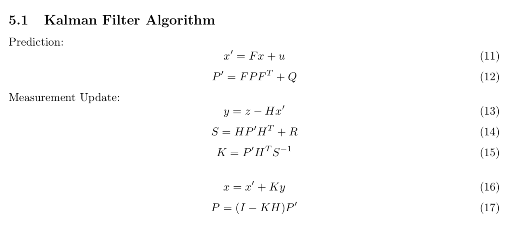
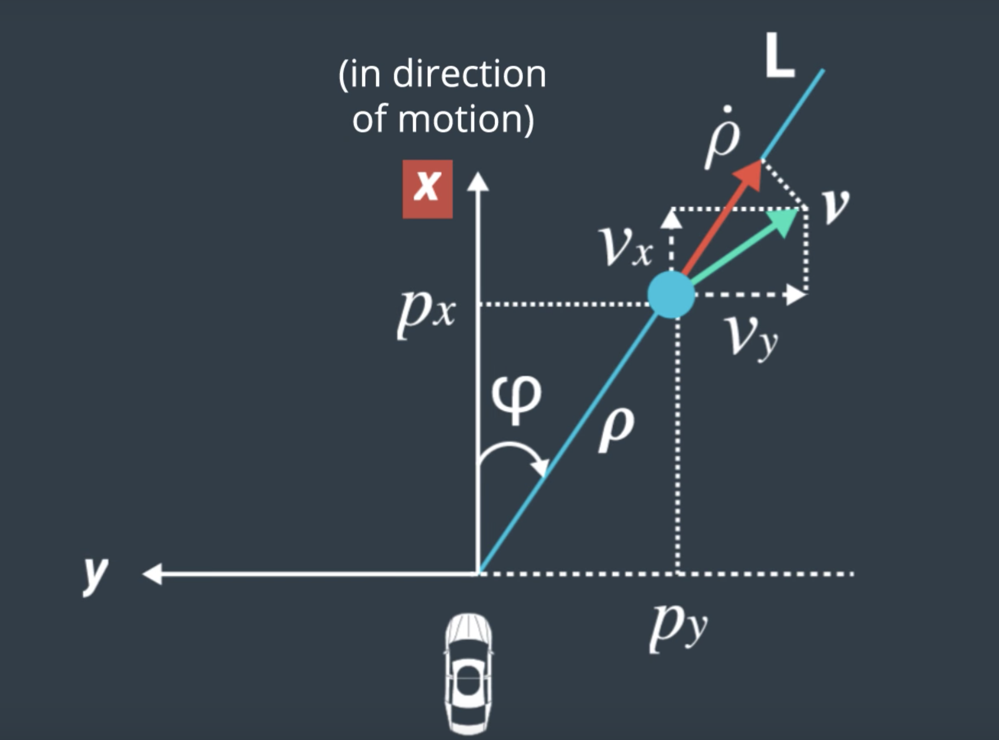
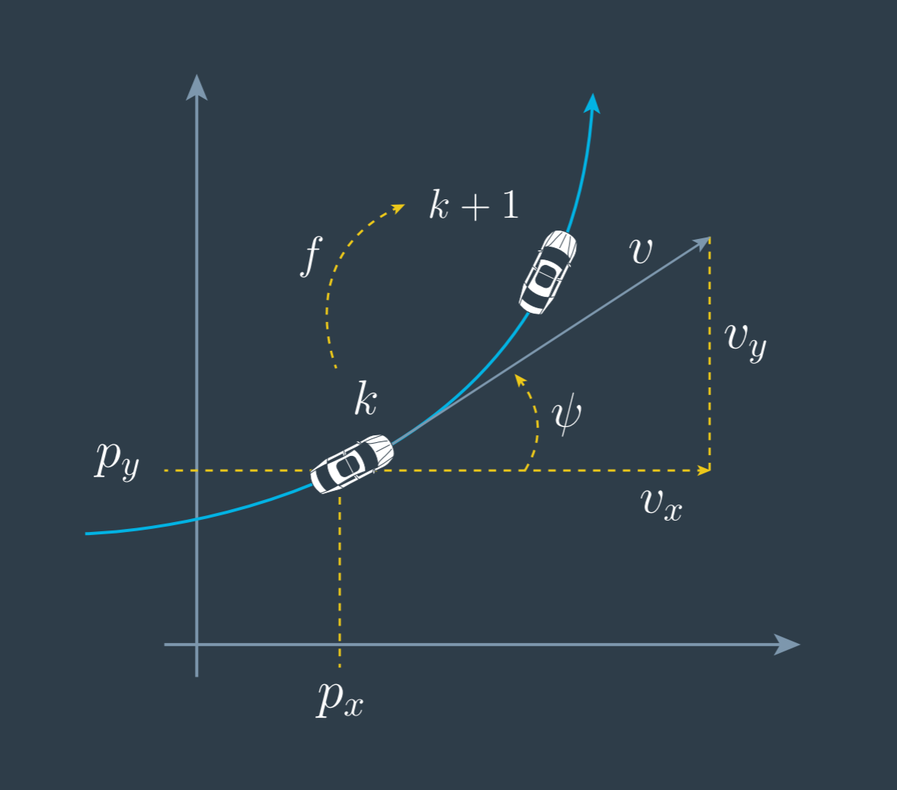

# Kalman Filter 

写完项目了，总结下几十天学过的东西。

## 项目的坑
1.忘了初始化部分的`x_state`的赋值
2.不需要使用jacobian更新y。

$$
y = z - H_j*x_{stste}
$$
而是使用：
$$
y = z - h(x_{state})
$$
在[这里](https://discussions.udacity.com/t/transform-the-current-state-into-the-measurement-space-cartesian-to-radial-coordinates-instead-of-multiplying-with-the-matrix-h-why/567248/9)有激烈的讨论。直接非线性化。**No**。下面简单解释一下：
- 由于非线性的transformation后，向量不符合高斯分布，所以用到泰勒展开：

$$
h(x) \approx h(x_{state}) + H_j * (x - x_{state})
$$
- 取极限会有奇妙的变化：

$$
 h(x) = \lim_{(x - x_{state})->0} h(x_{state}) + H_j * (x - x_{state})
$$

- so 

$$
y = z - h(x_{state}) - H_j*0 = z - h(x_{state})
$$

3.但是还是需要计算jacobian，为了下面的不确定性更新
4.时间截要转成秒(除以10**6)
5.归一化角度`const double normalized_phi = atan2(sin(phi), cos(phi));` 

## 为什么是Kalman Filter

- 看看我们的input:
	- lidar:[px, py]
	- radar:[rho, theta, rho_dot]

- 看看我们的输出：
	- [px, py, vx, vy]

**作用**
- kalman filter 能够根据lidar的两个元素，结合物理公式（先验知识）来推算出速度。
- 根据测试数据，kalman filter能够估算测量值跟真实值的误差

## 整个流程

- 初始化kalman filter变量
- 经过time step dt后做prediction
- 根据sensor measurement做update不断循环上面的步骤
- 用MSE评估好坏 

## 主要公式

## 最后一次review的启发

**你可能认为：有radar measurement就足够啦，位置速度都有了，还需要update么？**

但是这里的[discussion](https://discussions.udacity.com/t/mapping-from-radar-measurement-to-state-px-py-v-yaw-yaw-rate/237746)说得很清楚。`yaw != phi`

- phi只是行人相对于车的角度，并不是行人的速度朝向角度

- yaw是车的速度朝向角度

**所以radar measurement 无法知道物体的速度，物体的速度也需要用kalman filter来推断，真的很棒。kalman filter的设置真的很巧妙。**
